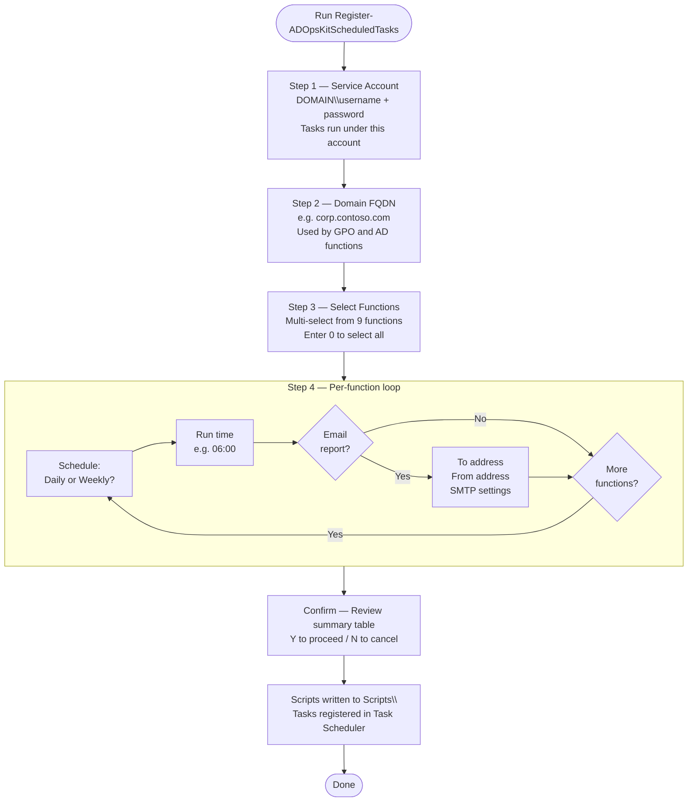
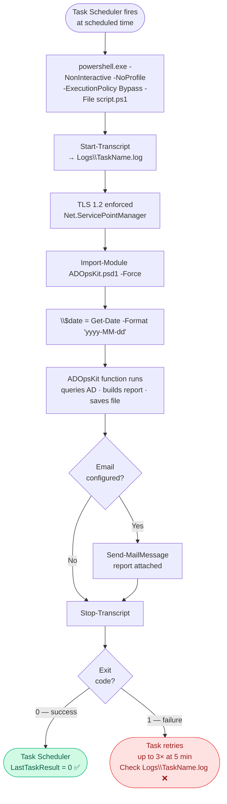
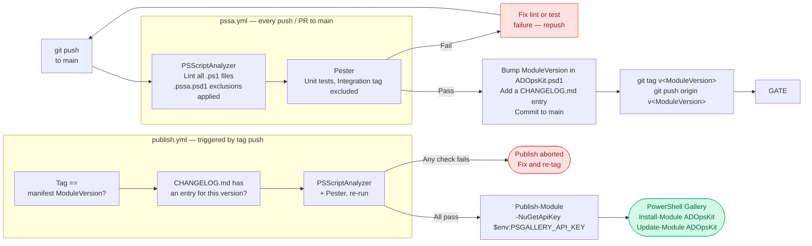

# ADOpsKit — Workflow

## 1 · End-to-End Overview

```mermaid
flowchart LR
    subgraph INSTALL["📦 Install"]
        PSG["PowerShell Gallery\nInstall-Module ADOpsKit"]
        MOD["ADOpsKit Module\nv1.2.0 · 11 functions"]
        PSG --> MOD
    end

    subgraph SETUP["⚙️ Setup"]
        WIZ["Register-ADOpsKit\nScheduledTasks\nInteractive wizard"]
        SCR["Scripts written to\nC:\\ADOpsKit\\Reports\\Scripts\\"]
        TSK["Windows Task Scheduler\n\\ADOpsKit\\ · 9 tasks"]
        MOD --> WIZ
        WIZ --> SCR
        WIZ --> TSK
    end

    subgraph RUN["▶️ Run"]
        DAILY["Daily 06:00\n5 health & audit tasks"]
        WEEKLY["Weekly Sunday 02:00\n4 inventory tasks"]
        MANUAL["Manual\nStart-ScheduledTask"]
        TSK --> DAILY & WEEKLY & MANUAL
    end

    subgraph OUTPUT["📂 Output"]
        REPORTS["C:\\ADOpsKit\\Reports\\\nDated HTML · CSV · JSON"]
        LOGS["C:\\ADOpsKit\\Reports\\Logs\\\nTranscript per task"]
        EMAIL["Email Delivery\nReport attached per task"]
        DAILY & WEEKLY & MANUAL --> REPORTS & LOGS
        REPORTS --> EMAIL
    end

    subgraph CICD["🔁 CI / CD"]
        GH["GitHub Push\nto main"]
        PSSA["PSScriptAnalyzer\nLint"]
        PES["Pester\nUnit Tests"]
        TAG["git tag v&lt;version&gt;\ngit push --tags"]
        GATE["Tag == manifest version?\nCHANGELOG entry present?\nLint + test pass?"]
        PUB["Publish-Module\nPowerShell Gallery"]
        GH --> PSSA --> PES
        PES --> TAG --> GATE --> PUB
        PUB --> PSG
    end
```



---

## 2 · Wizard Steps (Register-ADOpsKitScheduledTasks)



---

## 3 · Task Runtime Flow



---

## 4 · Functions at a Glance

| Function | Schedule | Output |
|----------|----------|--------|
| `Get-ADForestHealth` | Daily 06:00 | `yyyy-MM-dd_ADHealth_<forest>.html` |
| `Test-DCPortHealth` | Daily 06:10 | `yyyy-MM-dd_DCPortHealth.csv` |
| `Get-AccountLockoutReport` | Daily 06:20 | `.html` · `.csv` · `.txt` |
| `Get-InsecureLDAPBinds` | Daily 06:30 | `yyyy-MM-dd_InsecureLDAPBinds.csv` |
| `Get-EntraConnectSyncStatus` | Daily 06:40 | `yyyy-MM-dd_EntraConnectStatus.csv` |
| `Get-GPOInventory` | Weekly Sun 02:00 | `yyyy-MM-dd_GPOInventory.html` |
| `Get-GPOInventoryWithSettings` | Weekly Sun 02:15 | `yyyy-MM-dd_GPOInventoryWithSettings.html` |
| `Get-ADArchitectureAssessment` | Weekly Sun 02:30 | `.html` · `.json` · `Findings.csv` |
| `Get-ADReplicationTopologyDiagram` | Weekly Sun 02:45 | `yyyy-MM-dd_ADReplicationTopology.html` |
| `Enable-DCPerformanceBaseline` | Manual | Binary `.blg` perf logs on each DC |
| `Register-ADOpsKitScheduledTasks` | Manual | Writes `.ps1` scripts + registers tasks |

---

## 5 · Output Folder Structure

```
C:\ADOpsKit\Reports\
├── Get-ADForestHealth\
│   └── 2026-06-30_ADHealth_Karanth.Lab.html
├── Test-DCPortHealth\
│   └── 2026-06-30_DCPortHealth.csv
├── Get-AccountLockoutReport\
│   ├── 2026-06-30_Computers_Causing_Lockouts.html
│   ├── 2026-06-30_Computers_Causing_locked_users.csv
│   └── 2026-06-30_List_of_locked_users.txt
├── Get-InsecureLDAPBinds\
│   └── 2026-06-30_InsecureLDAPBinds.csv
├── Get-EntraConnectSyncStatus\
│   └── 2026-06-30_EntraConnectStatus.csv
├── Get-GPOInventory\
│   └── 2026-06-30_GPOInventory.html
├── Get-GPOInventoryWithSettings\
│   └── 2026-06-30_GPOInventoryWithSettings.html
├── Get-ADArchitectureAssessment\
│   └── ADArchitectureAssessment_20260630_060000\
│       ├── AD_Architecture_Assessment.html
│       ├── AD_Architecture_Assessment.json
│       └── Findings.csv
├── Get-ADReplicationTopologyDiagram\
│   └── 2026-06-30_ADReplicationTopology.html
├── Scripts\                        ← .ps1 files written by the wizard
│   ├── Get-ADForestHealth.ps1
│   └── ...
└── Logs\                           ← PowerShell transcripts
    ├── Get-ADForestHealth.log
    └── ...
```

---

## 6 · CI / CD Pipeline

Two workflows run in GitHub Actions. `pssa.yml` lints and tests every push
and pull request to `main`. `publish.yml` gates and performs the PowerShell
Gallery release, and only runs when a `v<ModuleVersion>` tag is pushed —
regular commits to `main` never publish by themselves.



**Releasing a new version:**

1. Bump `ModuleVersion` in [`ADOpsKit/ADOpsKit.psd1`](ADOpsKit/ADOpsKit.psd1) and add a matching `[<version>]` entry to [`CHANGELOG.md`](CHANGELOG.md).
2. Commit and push to `main` — `pssa.yml` lints and tests the change.
3. Tag the release and push the tag: `git tag v1.4.0 && git push origin v1.4.0`.
4. `publish.yml` re-verifies the tag matches the manifest version, checks for a CHANGELOG entry, re-runs lint + tests, then runs `Publish-Module` using the `PSGALLERY_API_KEY` repository secret.

---

## 7 · ADSetupKit — Companion Module

> Separate repo: [github.com/Karanth1992/ADSetupKit](https://github.com/Karanth1992/ADSetupKit)
> Use ADSetupKit **before** ADOpsKit — it provisions the server that ADOpsKit will then monitor.
> Its provisioning workflow diagrams now live in that repo's own [`WORKFLOW.md`](https://github.com/Karanth1992/ADSetupKit/blob/main/WORKFLOW.md).

---

## 8 · Version History

| Version | Date | What changed |
|---------|------|-------------|
| **1.2.0** | 2026-07-05 | `Register-ADOpsKitScheduledTasks` overhaul — credential validation, gMSA, config replay, retention, exit codes, ACL hardening |
| 1.1.6 | 2026-06-29 | Fix `Register-ADOpsKitScheduledTasks` — scripts written to `.ps1` files; dated filenames now expand correctly |
| 1.1.5 | 2026-06-29 | Fix `Get-AccountLockoutReport` — Int32 overflow; Copy-Item errors when no lockouts |
| 1.1.4 | 2026-06-29 | Per-task email recipients |
| 1.1.3 | 2026-06-29 | Email report delivery after each scheduled run |
| 1.1.2 | 2026-06-28 | Fix ambiguous parameter set on `Register-ScheduledTask` |
| 1.1.1 | 2026-06-28 | Fix `Test-DCPortHealth` blank service names |
| 1.1.0 | 2026-06-28 | Default output paths; wizard; `about_ADOpsKit` help |
| 1.0.1 | 2026-06-27 | Initial PSGallery release — 10 functions |
