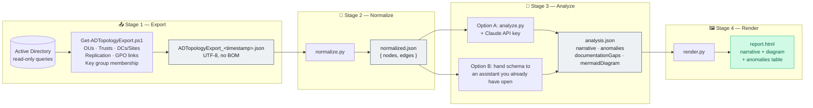
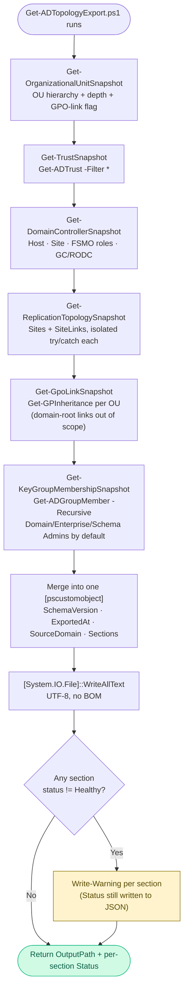
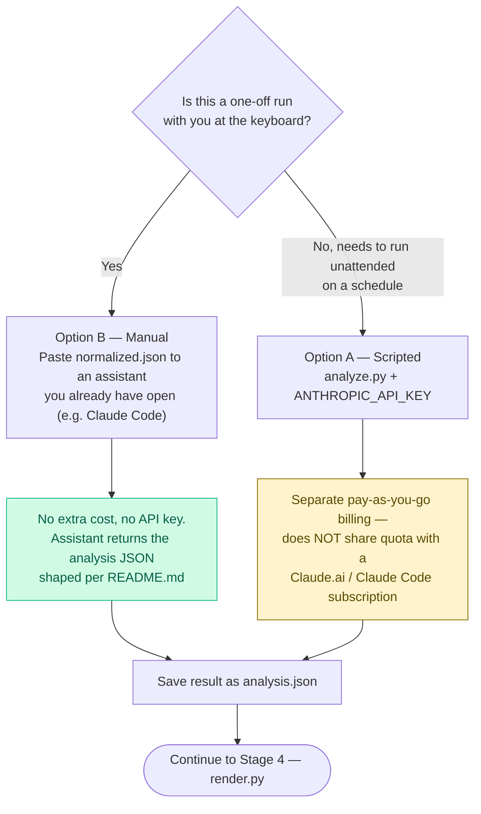

# ad-doc-generator — Workflow

## 1 · End-to-End Pipeline



---

## 2 · Stage 1 Detail — Export Script Internals

Each collection area runs in its own `try`/`catch` so one failing area (e.g.
no `GroupPolicy` module access) doesn't blank out the rest of the snapshot.



---

## 3 · Stage 3 Decision — Which Analysis Path



---

## 4 · Stages at a Glance

| Stage | Script | Input | Output |
|-------|--------|-------|--------|
| 1 · Export | `export/Get-ADTopologyExport.ps1` | Live AD (read-only) | `ADTopologyExport_<timestamp>.json` |
| 2 · Normalize | `normalize/normalize.py` | Stage 1 JSON | `normalized.json` — `{ nodes, edges }` |
| 3 · Analyze (Option A) | `analyze/analyze.py` | `normalized.json` + `ANTHROPIC_API_KEY` | `analysis.json` |
| 3 · Analyze (Option B) | *(manual — no script)* | `normalized.json` pasted to an assistant | `analysis.json` |
| 4 · Render | `render/render.py` | `analysis.json` | `report.html` |

---

## 5 · Output Folder Structure

Stage 1's default output folder, per this workspace's convention:

```
C:\Temp\Reports\ADDocGenerator\
├── ADTopologyExport_20260723_212457.json     ← Stage 1 raw export
├── normalized.json                            ← Stage 2 output
├── analysis.json                              ← Stage 3 output (either path)
└── report.html                                ← Stage 4 final report
```

Bundled demo artifacts (synthetic data, safe to keep in git):

```
samples/
├── sample-export.json        ← fake single-domain forest, fed to Stage 1's output shape
├── sample-normalized.json    ← Stage 2 output for the sample
├── sample-analysis.json      ← Stage 3 output for the sample (hand-written worked example)
└── sample-report.html        ← Stage 4 output for the sample
```

---

## 6 · Version History

| Version | Date | What changed |
|---------|------|---------------|
| **1.0.0** | 2026-07-24 | Initial pipeline: `Get-ADTopologyExport.ps1`, `normalize.py`, `analyze.py`, `render.py`, sample data. Verified end-to-end against a real domain-joined lab. Two bugs found and fixed during that verification: a `Set-StrictMode`/`.Count`-on-`$null` crash when an AD query returns no results, and a UTF-8 BOM from `Out-File` that broke Python's `json.load`. See [CHANGELOG.md](CHANGELOG.md#100--2026-07-24). |
